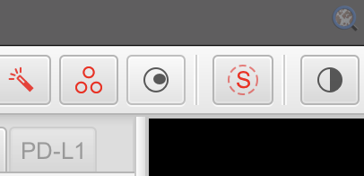
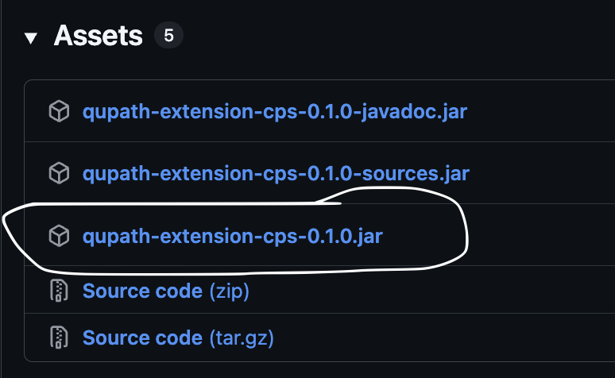
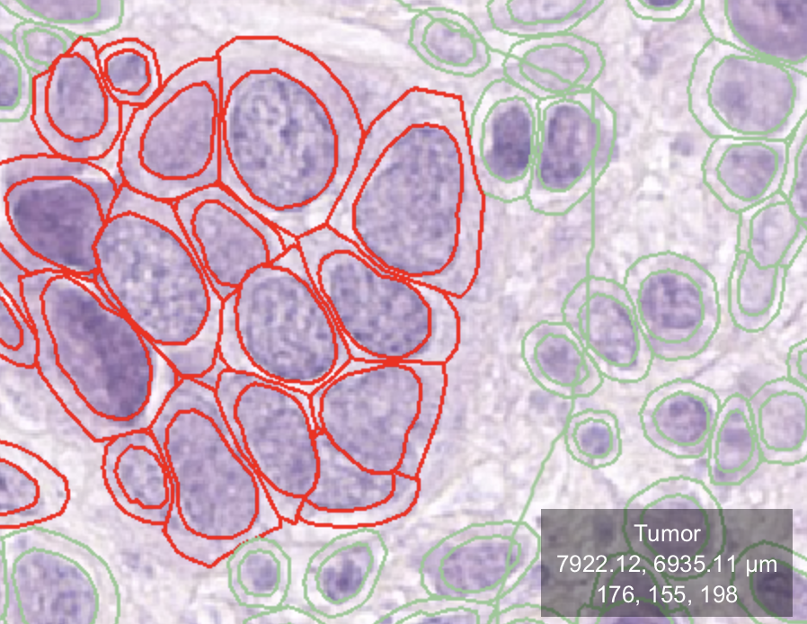
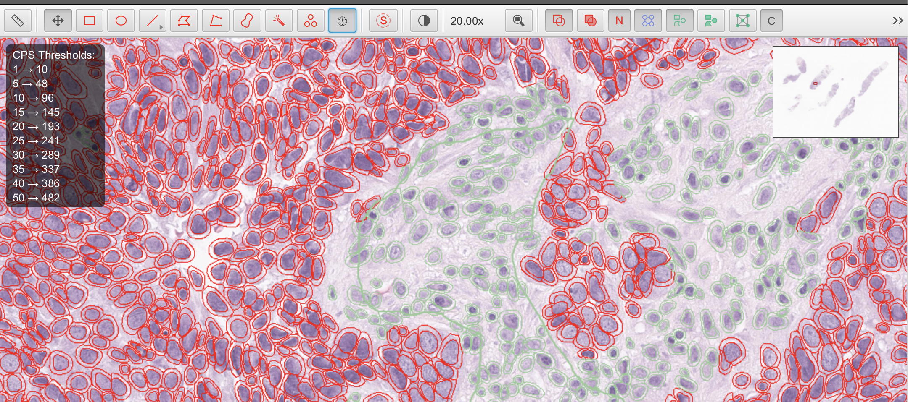
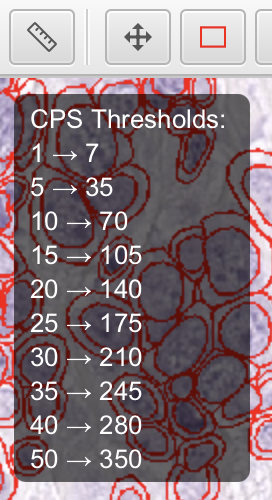
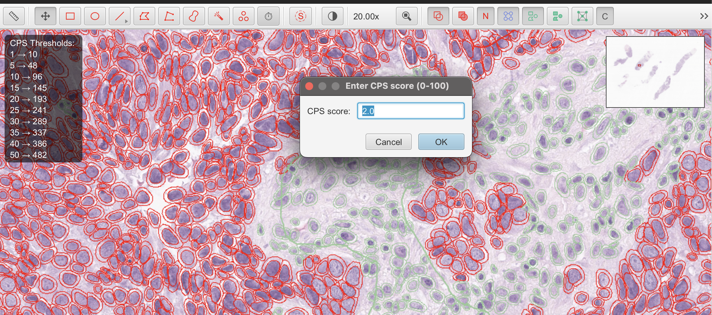
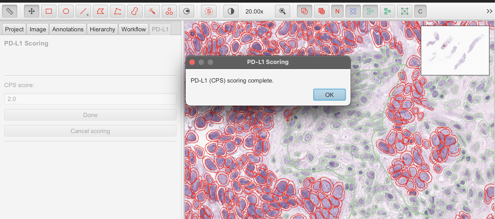

# QuPath CPS Score Extension

Timed PD-L1 (CPS) scoring for an **unmodified** QuPath install.

## What it does

- A toolbar toggle (cell-nuclei icon, right after the drawing tools) starts scoring: it asks for
  consent and your name, starts a timer, shows live tumor-cell / nuclei counts for the current view
  as an on-screen overlay, hides the analysis pane and zooms to 20x.
- Clicking the toggle again asks for the CPS score (0-100), saves it, stops the timer and opens the
  **PD-L1** tab in the analysis pane. Press **Done** there to write the result row.
- The same toggle is available under **Extensions > CPS Score**.

  

### Data recorded

Your name (as entered), slide name, CPS score, tumor-cell and nuclei counts, start/stop time and
elapsed time. Rows are appended to `pdl1_logs/pdl1_results.csv` next to the QuPath project, and the
CPS score and timer values are stored in the project entry's metadata (keys `PDL1_*`). These names
are unchanged from the earlier forked build, so existing results stay compatible.

## For users: install

Requires **QuPath 0.7.0**.

1. Download `qupath-extension-cps-<version>.jar` from the [Releases](../../releases) page
   (just that one file; ignore any `-sources` or `-javadoc` jars).
2. Drag the jar onto the QuPath window. 
3. Restart QuPath.

  

**Updating:** close QuPath, delete the old jar from the extensions folder
(Extensions > Manage extensions > open extensions directory), copy in the new one, restart.
Don't keep two versions of the jar in that folder.

## For users: scoring a slide

1. Open the image and classify tumor and non-tumor cells.

    

2. Click the CPS toggle to start scoring. Give consent and enter your name.

    

3. Review the view. Live tumor-cell and nuclei counts are shown as an overlay.

    

4. Click the toggle again and enter the CPS score (0-100).

   

6. In the **PD-L1** tab, press **Done** to save the result.

   

## For developers: build

Requires JDK 25 (the version QuPath 0.7.0 itself is built with). Build on a local disk, not a network drive.

    ./gradlew build

The jar is written to `build/libs/qupath-extension-cps-<version>.jar`.

## Making a release

1. Set the release `version` in `build.gradle.kts` (no `-SNAPSHOT`) and commit.
2. On GitHub: **Actions > Make draft release > Run workflow**. This builds the extension
   and creates a *draft* release with the jar attached.
3. Open the draft under **Releases**, add release notes (include "Requires QuPath 0.7.0"),
   and publish.
4. After publishing, bump the version for the next round of development.

## Upgrading QuPath

Change `qupath { version = "..." }` in `settings.gradle.kts` and `QUPATH_VERSION`
in `CPSScoreExtension.java`, rebuild, and retest before releasing.

## Acknowledgements

This CPS project was made possible through the generous support and partnership of [Merck Canada](https://www.merck.ca/en/).

### Development & support

This extension is developed at the University of Alberta by:

* [Dr. Gilbert Bigras](https://github.com/gilbertbigras)
* [Dr. Nilanjan Ray](https://scholar.google.ca/citations?user=E3wuLqAAAAAJ&hl=en)
* [Dr. Abhineet Singh](https://github.com/abhineet123)
* [Nasif Hossain](https://github.com/nasif92)

Built on [QuPath](https://qupath.github.io/), developed at the University of Edinburgh by
Pete Bankhead, Alan O'Callaghan and Laura Nicolás-Sáenz, with thanks to past team members.
See the [QuPath contributors](https://github.com/qupath/qupath/graphs/contributors).
